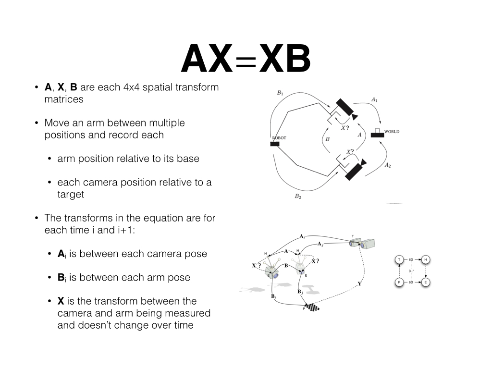

**Purpose:**

This repo serves as a ros independent build of handeye calibration. It main purpose is to remove those dependencies that
https://github.com/jhu-lcsr/handeye_calib_camodocal requires, which are not really needed when we do not use ROS.
It only solves AX = XB and gives X, which should be the transformation from eye frame to robot flange frame.

Reference: https://github.com/jhu-lcsr/handeye_calib_camodocal

**Currently supported:**
1. windows vs2015

**Dependencies**
1. Opencv3 (tested on opencv 3.2.0)
2. Eigen3
3. ceres-solver

**User Guide for windows**
1. Put dependencies to ./handeye_calib/3rd_lib
2. Build the exe with the dependencies
3. Input: transpair.yml; Explanation  T1: Robot pose or baseTee , T2:the transform from camera coordinate frame to AR code/chess board coordinate frame.
4. Input: config.json; you can find an example in ./example_resource
5. Output: eeTeye.yml, it is the transform from the eye frame to the robot flange frame
